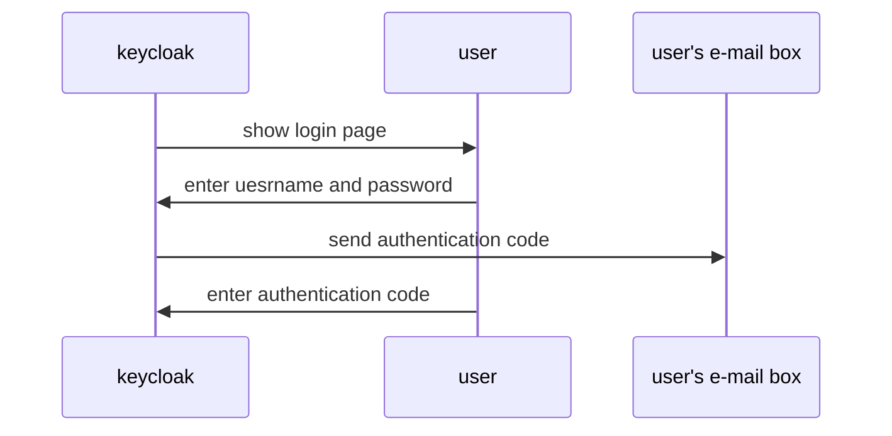
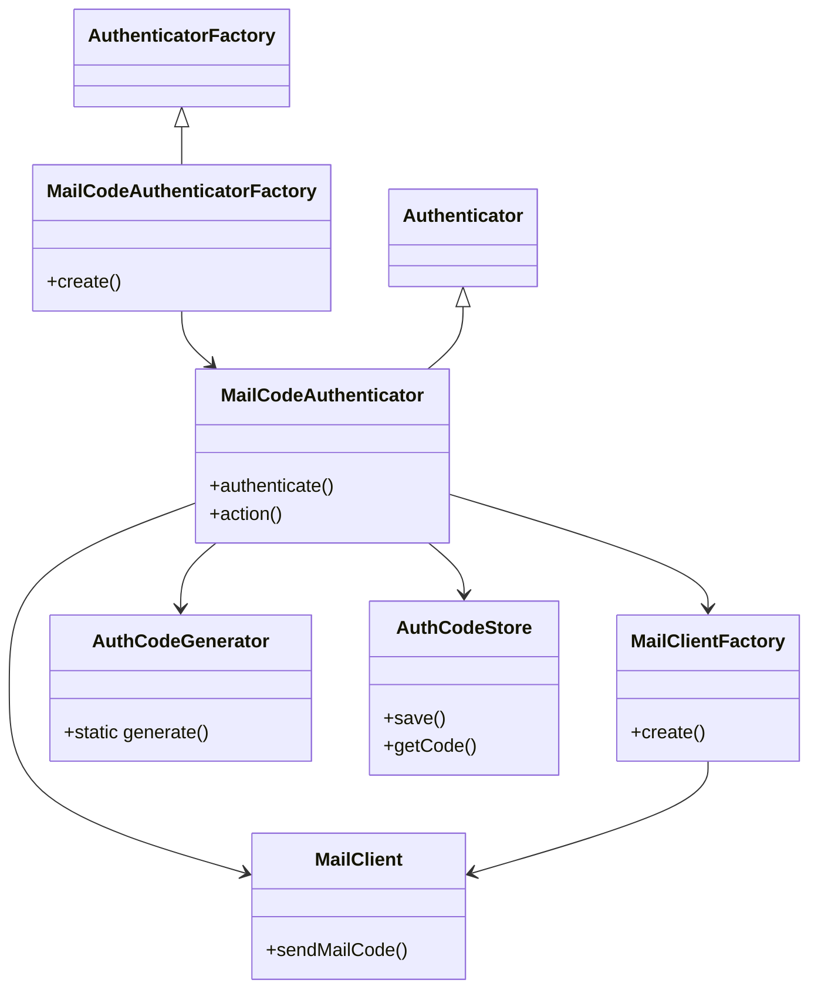

# keycloak-mail-otp-spi
This is a service provider interface (SPI) of keycloak which can add one time pad (OTP) based two-factor authentication sending by email.

## How to build and deploy
As described in [keycloak Doc](https://keycloak-documentation.openstandia.jp/master/ja_JP/server_development/index.html#_providers), this SPI can be build and deploy via below commands.
```
$ mvn package
$ cp ./custom-mail-auth/target/mail-authenticator.jar [KEYCLOAK_HOME]/provider/
$ cp ./custom-themes/target/mail-auth-theme.jar [KEYCLOAK_HOME]/provider/
```

## Component structure
